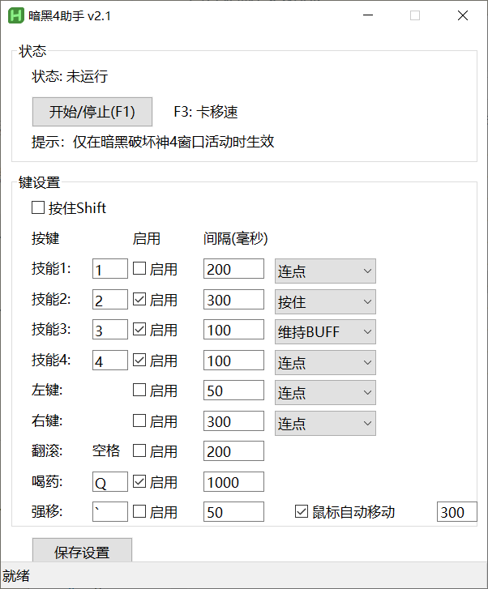

# D4keyHelp

D4KeyHelp是一个有图形界面，可自定义配置的暗黑4鼠标宏工具。

运行代码请使用最新版的AHK v2.0软件!并非常见的V1.3的版本,你也可以直接在release处下载.exe而不安装AHK.

F1启动/暂停战斗宏

tab键查看地图的时候会暂停宏(但是有概率不起效果)

F3卡移速,需要在城镇里面骑着马使用.卡一次加50%,卡两次就满了

维持BUFF的勾选框,目前仅支持2K分辨率+ 暗黑4内设置技能框在正中下方的UI设置

---
原本是打算改改 @https://github.com/WeijieH/D3keyHelper 用的,但是发现AHK1.3不论我怎么改在暗黑4都有奇怪的卡鼠标的问题(按F1暂停有概率鼠标卡住不动,宏也不会停止),改成AHK2.0之后问题消失了,但是也没有兴趣再移植老沙宏到AHK2.0了.随便写了个,就用这个吧
