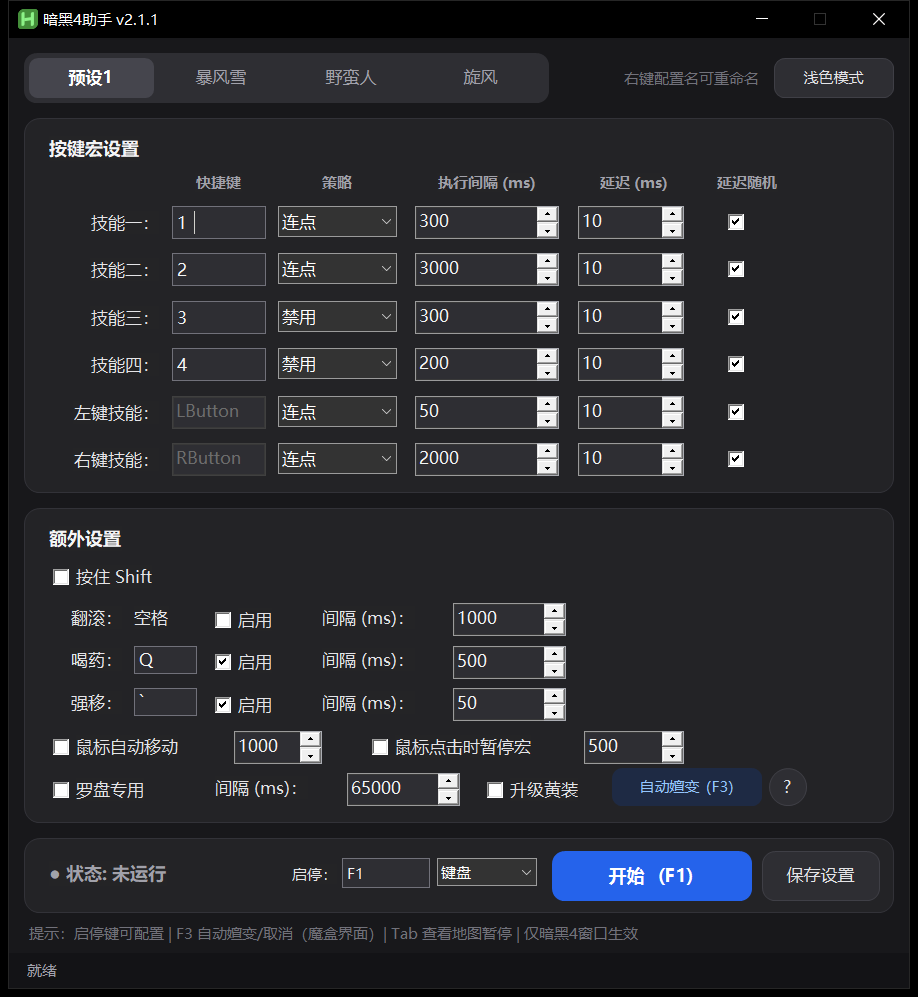

# D4keyHelp

[](https://opensource.org/licenses/MIT)
[](https://www.autohotkey.com/)
[](https://github.com/duzefu/D4keyHelp/releases)

一个有图形界面、可自定义配置的**暗黑破坏神4**键鼠宏工具。基于 AutoHotkey v2.0，所有热键仅在暗黑4窗口激活时生效。

| 浅色模式 | 深色模式 |
| :---: | :---: |
|  |  |

---

## 目录

- [快速开始](#快速开始)
- [界面说明](#界面说明)
- [热键一览](#热键一览)
- [功能详解](#功能详解)
- [使用限制](#使用限制)
- [项目结构](#项目结构)
- [关于](#关于)

---

## 快速开始

### 方式一：直接下载 exe（推荐，无需装 AHK）

前往 [Releases](https://github.com/duzefu/D4keyHelp/releases) 下载 `D4keyHelp.exe`，双击运行。

### 方式二：运行源码

1. 安装 **最新版 AutoHotkey v2.0**（注意：**不是**常见的 v1.3，二者不兼容）
2. 双击 `macro_script_v3.ahk` 运行（模块化版本，推荐）

### 三步上手

1. 启动后在 **按键宏设置** 里给技能选好「策略」和「执行间隔」
2. 切回游戏，按 **F1** 开始（再按一次停止）
3. 关窗口或点「保存设置」即自动写入 `settings.ini`，下次启动自动恢复

---

## 界面说明

界面分为三块卡片，右上角可切换浅色/深色模式（切换会重载脚本，需先停止宏）。

### 1. 按键宏设置

六行：**技能一～技能四** + **左键技能** + **右键技能**。每行可配置：

| 列 | 说明 |
| --- | --- |
| 快捷键 | 技能1-4 可自定义按键；左右键固定为鼠标左/右键 |
| 策略 | `禁用` / `连点` / `维持BUFF` / `按住` |
| 执行间隔 (ms) | 两次触发之间的间隔，默认 300 |
| 延迟 (ms) | 按下与松开之间的延迟，默认 10 |
| 延迟随机 | 勾选后给延迟加随机抖动，默认开启 |

三种策略的区别：

- **连点** — 按固定间隔不停触发，适合输出技能
- **维持BUFF** — 先取色检测技能图标状态，BUFF 掉了才补，避免无脑刷新
- **按住** — 保持按住状态，适合需要持续施放的技能

### 2. 额外设置

| 功能 | 默认键 | 默认间隔 | 说明 |
| --- | :---: | ---: | --- |
| 按住 Shift | — | — | 开启后所有宏按键都带 Shift（原地施法） |
| 翻滚 | 空格 | 1000 ms | 自动翻滚 |
| 喝药 | Q | 15000 ms | 自动喝药 |
| 强移 | `` ` `` | 50 ms | 自动强制移动 |
| 鼠标自动移动 | — | 1000 ms | 六点屏幕移动模式，罗盘挂机用 |
| 鼠标点击时暂停宏 | — | 3000 ms | 手动点击后暂停一段时间，方便捡装备/操作 UI |
| 罗盘专用 | — | 65000 ms | 定时点击脚下贡品，自动开下一关 |
| 升级黄装 | — | — | 自动嬗变时顺带把黄装升成传奇 |

### 3. 底部控制

- **状态**：未运行 / 运行中 / 已暂停 / 临时暂停
- **启停键**：可设为键盘热键，或鼠标中键 / 侧键1 / 侧键2（不支持左右键）
- **开始/停止**按钮：运行中会变成红色的「停止」
- **保存设置**：手动保存；修改控件时也会自动保存，退出时再保存一次

### 4. 配置预设

顶部有 **配置1～配置4** 四套独立预设，点击即切换，**右键配置名可重命名**。所有设置持久化在 `settings.ini`（UTF-16 编码），首次运行自动生成默认值。

---

## 热键一览

> 全部热键只在暗黑4窗口激活时生效。

| 热键 | 作用 |
| :---: | --- |
| **F1** | 启动 / 停止战斗宏（可在界面底部改绑） |
| **F3** | 自动嬗变；运行中再按一次取消 |
| **Tab** | 查看地图时暂停宏，关掉地图恢复（有概率不生效） |
| **鼠标左/右键** | 开启「鼠标点击时暂停宏」后，手动点击会临时暂停 |

---

## 功能详解

### F3 自动嬗变

在**赫拉迪姆魔盒**界面按 F3：扫描右下角 11 列 × 3 行物品格（单次截图 + 对截图取色），按边框 orange/red 光效识别传奇装备，跳过黄色稀有、蓝色魔法和空格子，然后逐个右键传奇物品并点击嬗变/重塑。运行中再按 F3 可随时取消。

### 升级黄装

勾选后，自动嬗变会先处理黄装：给黄装添加词条（如果已经是四词条，则随机重置一个词条），升级成传奇物品后再进行嬗变。

### 维持BUFF

通过屏幕像素取色判断技能图标是否还亮着，只在 BUFF 掉了时才补。**目前仅在 2K 分辨率下验证过**，且需要游戏内 UI 设置为技能框在正中下方。其他分辨率理论可用，未测试，请自行验证。

### 鼠标自动移动 + 罗盘专用

**鼠标自动移动**是专门为罗盘设计的，配合强制移动，它会让你在罗盘里绕着圆圈走，自动捡魂魄，也自动打怪。只要在组队里有人替你选贡品，就可以全程挂机。

**罗盘专用**原本设计成全自动选贡品：每打怪约一分钟就点击脚下的贡品，然后自动开始下一关。这种玩法只适合不需要走位、且全程状态免疫的 BD，否则会出问题。


---

## 使用限制

- 需要 **AutoHotkey v2.0**，与 v1.3 不兼容
- 取色相关功能（维持BUFF、自动嬗变）针对 **2K 分辨率** 和默认 UI 布局优化
- 所有热键**仅在暗黑4窗口激活时生效**，切出游戏自动暂停
- Tab 暂停有概率不生效
- 调试日志写入 `debugd4.log`

---

## 项目结构

```
macro_script_v3.ahk         # 主入口（模块化版本）
├── core/                   # 全局变量、窗口管理、定时器、宏控制、热键管理
├── gui/                    # 主界面、技能控件、额外设置控件、现代化 UI 组件
├── functions/              # 技能系统、鼠标动作、功能键与自动嬗变
├── utils/                  # 日志、设置读写
└── hotkeys/                # 游戏内热键定义
```

无构建/测试步骤，直接运行即可。除 AutoHotkey v2.0 运行时外无外部依赖。

---

## 关于

### 由来

原本是打算改改 [@WeijieH/D3keyHelper](https://github.com/WeijieH/D3keyHelper) 用的，但是发现 AHK 1.3 不论我怎么改在暗黑4都有奇怪的卡鼠标的问题（按 F1 暂停有概率鼠标卡住不动，宏也不会停止），改成 AHK 2.0 之后问题消失了。但也没有兴趣再移植老沙宏到 AHK 2.0 了，随便写了个，就用这个吧。

### 杂谈

1. 本脚本含有点位取色功能（用于提供维持BUFF功能），不知道会不会封号
2. 仅我个人而言，我用了好几个赛季从没被封过（steam 国际服），导航也是用得飞起，感觉没那么容易封号
3. 不过这种鼠标宏在很多情况下不如手柄宏，用过 steam 手柄宏的应该懂我在说什么，所以也没有那么有用

### 许可证

[MIT](https://opensource.org/licenses/MIT)

---

## Star History

<a href="https://star-history.com/#duzefu/D4keyHelp&Date">
  <picture>
    <source media="(prefers-color-scheme: dark)" srcset="https://api.star-history.com/svg?repos=duzefu/D4keyHelp&type=Date&theme=dark" />
    <source media="(prefers-color-scheme: light)" srcset="https://api.star-history.com/svg?repos=duzefu/D4keyHelp&type=Date" />
    
  </picture>
</a>
