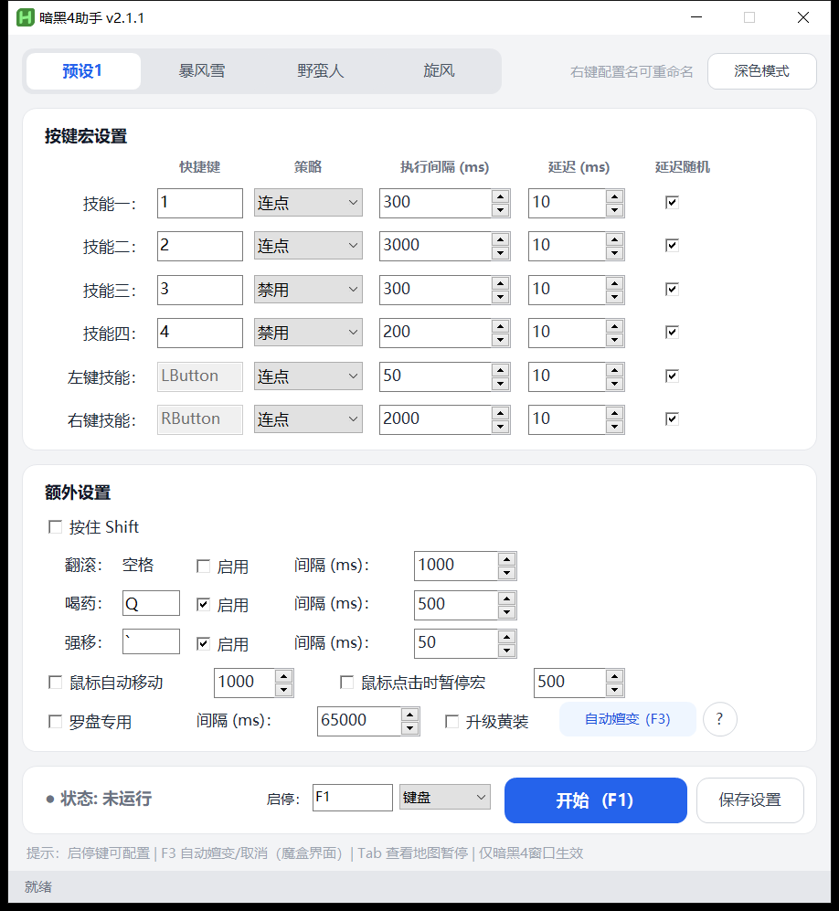

# D4keyHelp

D4KeyHelp是一个有图形界面，可自定义配置的暗黑4鼠标宏工具。

运行代码请使用最新版的AHK v2.0软件!并非常见的V1.3的版本,你也可以直接在release处下载.exe而不安装AHK.

F1启动/暂停战斗宏

tab键查看地图的时候会暂停宏(但是有概率不起效果)

**维持BUFF**的功能,目前仅支持2K分辨率(其他分辨率我没有测试过,请自行测试,理论上是可用的。)+ 暗黑4内设置技能框在正中下方的UI设置

**鼠标自移动**是专门为了罗盘使用的，配合强制移动，它会让你在罗盘里面绕着圆圈走。自动捡魂魄，也自动打怪。只要在组队里，有人替你选贡品的话，就可以全程挂机。

**罗盘专用**这个按钮是原本设计成全自动选贡品的，就是每打怪一分钟 他都会点击脚下的那个贡品，然后自动开始下一关。但这种只适合不需要动来动去 并且 全程状态免疫的BD, 不然会有问题.

---
原本是打算改改 @https://github.com/WeijieH/D3keyHelper 用的,但是发现AHK1.3不论我怎么改在暗黑4都有奇怪的卡鼠标的问题(按F1暂停有概率鼠标卡住不动,宏也不会停止),改成AHK2.0之后问题消失了,但是也没有兴趣再移植老沙宏到AHK2.0了.随便写了个,就用这个吧

---
杂谈: 
1. 本脚本含有点位取色功能(用于 提供维持BUFF功能), 不知道会不会封号
2. 仅我个人而已, 我用了好几个赛季了从没被封过(steam国际服), 导航也是用的飞起. 感觉没那么容易封号
3. 不过这种鼠标宏部分在很多情况不如手柄宏, 用过steam 手柄宏的应该懂我在说什么. 所以也而没有那么有用
