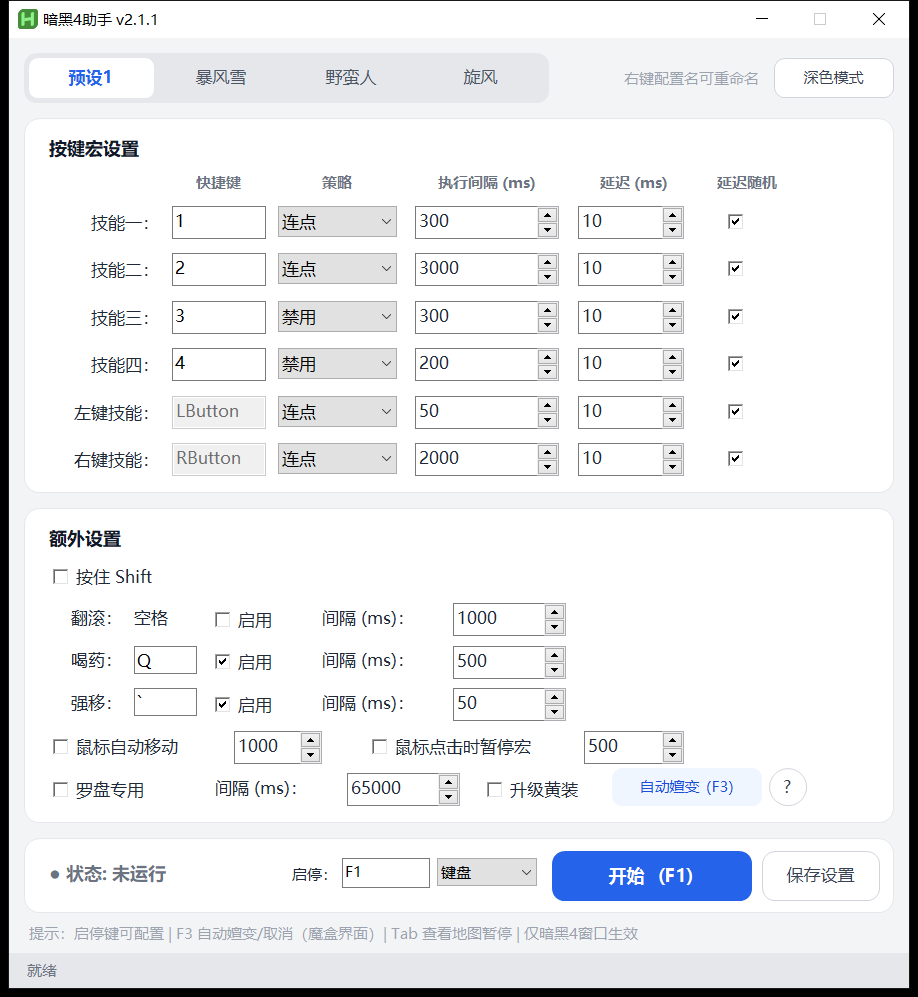
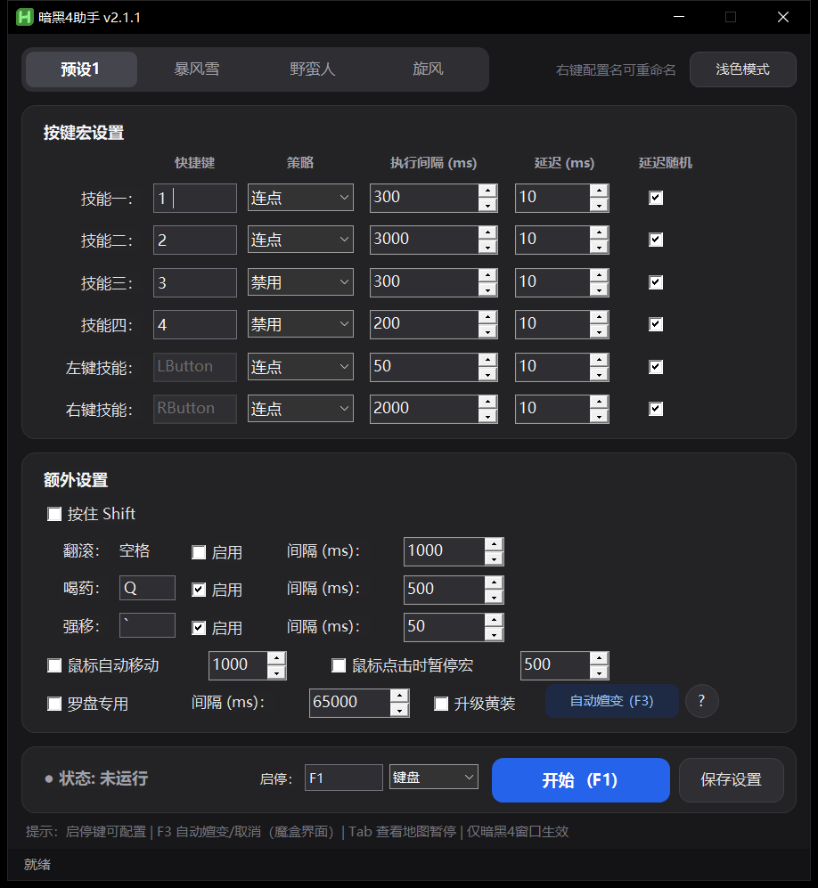

# D4keyHelp

<div align="center">

[简体中文](README.md) · **English**

</div>

[](https://opensource.org/licenses/MIT)
[](https://www.autohotkey.com/)
[](https://github.com/duzefu/D4keyHelp/releases)

A **Diablo IV** keyboard/mouse macro tool with a GUI and customizable profiles. Built on AutoHotkey v2.0; all hotkeys only work while the Diablo IV window is active.

**Demo video** (1 min 38 s, covers every feature and how to get started)

https://github.com/user-attachments/assets/26f0ba7f-a3bc-4468-b734-fce76c4f680c

| Light theme | Dark theme |
| :---: | :---: |
|  |  |

---

## Table of Contents

- [Quick Start](#quick-start)
- [UI Overview](#ui-overview)
- [Hotkeys](#hotkeys)
- [Features](#features)
- [Limitations](#limitations)
- [About](#about)

---

## Quick Start

### Option 1: Download the exe (recommended, no AHK needed)

Grab `D4keyHelp.exe` from [Releases](https://github.com/duzefu/D4keyHelp/releases) and double-click it.

### Option 2: Run from source

1. Install the **latest AutoHotkey v2.0** (note: **not** the more common v1.3, the two are incompatible)
2. Double-click `macro_script_v3.ahk`

### Three steps to get going

1. After launching, pick a **Mode** and an **Interval** for each skill under **Skill Macro**
2. Switch back to the game and press **F1** to start (press it again to stop)
3. Your settings are saved automatically and restored on the next launch

---

## UI Overview

The window is made up of three cards, with four profiles along the top. In the top-right corner you can switch between light/dark theme and switch the UI language (Chinese / English, Chinese by default). Both actions reload the script, so stop the macro first.

### 1. Skill Macro

Six rows: **Skill 1–4** + **LMB skill** + **RMB skill**. Each row has:

| Column | Description |
| --- | --- |
| Key | Skills 1-4 accept any key; the mouse skills are fixed to the left/right mouse button |
| Mode | `Off` / `Repeat` / `Keep buff` / `Hold` |
| Interval (ms) | Time between two triggers, 300 by default |
| Delay (ms) | Delay between press and release, 10 by default |
| Random delay | Adds random jitter to the delay, on by default |

How the modes differ:

- **Repeat** — triggers over and over at a fixed interval, good for damage skills
- **Keep buff** — watches the skill icon and only re-casts once the buff has dropped, instead of mashing the key
- **Hold** — keeps the key held down, good for channeled skills

### 2. Extra Settings

| Feature | Default key | Default interval | Description |
| -------- | --- | -------- | ----------------------- |
| Hold Shift | —   | —        | Every macro key press is sent with Shift (attack in place) |
| Dodge | Space | 1000 ms  | Automatic dodge |
| Potion | Q   | 15000 ms | Drinks automatically; tick **HP check** to drink based on the health globe instead (see below) |
| HP check | —   | —        | Detects the health globe and estimates your HP, drinking only below the **HP threshold** |
| Skip if shielded | —   | —        | A shield covering the globe hides your real HP: checked = skip (default), unchecked = drink anyway |
| Force move | ``` | 50 ms    | Automatic force move |
| Auto mouse move | —   | 1000 ms  | Six-point screen movement pattern, for AFK compass farming |
| Pause on click | —   | 3000 ms  | Pauses the macro for a while after you click manually, handy for looting or using the UI |
| Compass mode | —   | 65000 ms | Clicks the offering at your feet on a timer to start the next run automatically |
| Upgrade rares | —   | —        | Also upgrades rare items to Legendary while auto-transmuting |
| Test globe | —   | —        | Detects the globe once, 3 seconds after clicking (time to switch back to the game); the result shows up in the status bar below |
| HP threshold | —   | 50 %     | Drink only below this HP percentage (50 is exactly the middle of the globe) |
| Debug log | —   | —        | When off, nothing is logged; the adjacent **Clear log** deletes the existing logs |

### 3. Bottom Bar

- **Status**: Not running / Running / Paused / Temp paused
- **Toggle key**: can be a keyboard hotkey, or Middle / Side 1 / Side 2 mouse button (left and right buttons are not allowed)
- **Start/Stop** button: turns into a red "Stop" while running
- **Save settings**: manual save; changing a control also auto-saves, and the settings are saved once more on exit

### 4. Profiles

The top of the window holds four independent profiles, **Profile 1–4** by default; click one to switch, **right-click a profile name to rename it**. Everything is saved automatically and restored on the next launch. Profiles you have not renamed follow the UI language.

---

## Hotkeys

> Every hotkey only works while the Diablo IV window is active.

| Hotkey | Action |
| :---: | --- |
| **F1** | Start / stop the combat macro (rebindable from the bottom bar) |
| **F3** | Auto transmute; press again while running to cancel |
| **Tab** | Pauses the macro while the map is open, resumes when it closes (may not always work) |
| **LMB / RMB** | With **Pause on click** enabled, a manual click pauses the macro temporarily |

---

## Features

### F3 auto transmute

At the **Horadric Cube** screen, press F3: it scans the item grid at the bottom right, identifies Legendary items by the orange/red glow on their border, skips Rare (yellow), Magic (blue) and empty slots, then right-clicks each Legendary in turn and clicks transmute/reforge. Press F3 again at any time to cancel.

### Upgrade rares

When ticked, auto transmute handles rare items first: it adds an affix to the rare (or randomly rerolls one if it already has four), upgrades it to Legendary, and then transmutes it.

### Keep buff

Watches the skill icon to see whether the buff is still up, and only re-casts once it has dropped. **Only verified at 2K resolution** so far, and it requires the in-game UI to have the action bar centered at the bottom. Other resolutions should work in theory but are untested — verify for yourself.

### Conditional potion (HP check)

By default the potion key is just pressed on a timer. With **HP check** ticked, the macro reads the health globe and decides:

1. It locates the orb center and the liquid level on its own, with no manual point picking
2. The liquid level is converted into an HP percentage, matching how the globe reads in-game
3. The potion key is only pressed below the **HP threshold**; pressing it at high HP does nothing anyway, so no potions are wasted

A few notes:

- **Threshold**: 50% is exactly the middle line of the globe. Raise it to drink earlier (70%, say), lower it to save potions
- **Interval**: setting the potion interval to 1000–2000 ms is recommended
- **Shields**: a shield covering the globe hides the real HP. "Skip if shielded" is on by default because the shield is already absorbing damage; if your build keeps a shield up permanently, untick it and the macro will drink as usual
- When the globe cannot be detected (covered by UI, not in game, …) it falls back to the original "drink on a timer" behaviour instead of skipping potions

### Auto mouse move + Compass mode

**Auto mouse move** was made for the compass: combined with force move, it walks you in circles so you collect souls and fight automatically. As long as a teammate picks the offering, you can AFK the whole run.

**Compass mode** was originally designed to pick the offering fully automatically: about once a minute of fighting it clicks the offering at your feet and starts the next run by itself. This only suits builds that need no positioning and are immune to everything, otherwise it will cause trouble.

Illustration

---

## Limitations

- Requires **AutoHotkey v2.0**; incompatible with v1.3
- The pixel-detection features (Keep buff, auto transmute) are tuned for a **2K resolution** and the default UI layout
- HP check derives the globe's position from the screen size; other resolutions should work but are untested. If detection looks off, click **Test globe** and check the result in the status bar
- All hotkeys **only work while the Diablo IV window is active**; the macro pauses automatically when you switch away
- Tab pausing may not always work

---

## About

### Background

It started as an attempt to tweak [@WeijieH/D3keyHelper](https://github.com/WeijieH/D3keyHelper), but no matter how I changed it, AHK 1.3 had a weird "mouse gets stuck" issue in Diablo IV (pressing F1 to pause could leave the mouse frozen while the macro kept running). Porting it to AHK 2.0 made the problem disappear. I didn't feel like porting the old macro to AHK 2.0 either, so I just wrote a small one — this is it.

### Notes

1. This script uses pixel sampling (for the Keep buff feature); I have no idea whether it can get you banned
2. Personally I have played several seasons without ever being banned (Steam, international server), including heavy use of overlays, so I don't think a ban is likely
3. That said, a mouse macro like this is often worse than a controller macro — anyone who has used Steam's controller macros will know what I mean — so it isn't all that powerful either

### License

[MIT](https://opensource.org/licenses/MIT)

---

## Star History

<a href="https://star-history.com/#duzefu/D4keyHelp&Date">
  <picture>
    <source media="(prefers-color-scheme: dark)" srcset="https://api.star-history.com/svg?repos=duzefu/D4keyHelp&type=Date&theme=dark" />
    <source media="(prefers-color-scheme: light)" srcset="https://api.star-history.com/svg?repos=duzefu/D4keyHelp&type=Date" />
    
  </picture>
</a>
